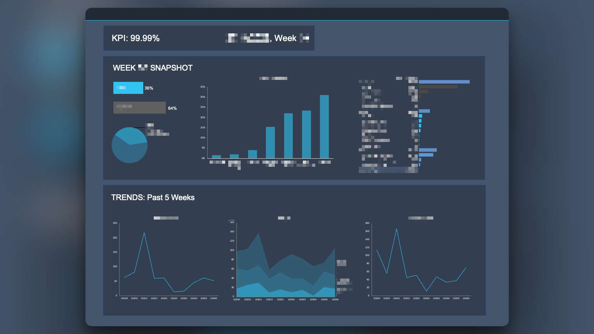

# Data Portfolio

Hi, welcome to my data portfolio. I'm currently a student at UNSW Sydney undertaking a double degree in Economics (Econometrics and Data Analytics) and Arts (Politics and International Relations). You can find some of the projects I've had the pleasure of working on here. Below are some of the highlights.  

**Internships**
- [Logistics Network Performance Dashboard - Amazon Internship Summer '22-'23](#logistics-network-performance-dashboard---amazon-internship-summer-22-23)
  - SQL (PostgreSQL, SQLite)
  - Python (Pandas, Matplotlib)
  - Microsoft Excel (Power Query, Pivot Tables/Charts)

**Personal Projects**
- [MMA - Webscraping & EDA](#MMA---Webscraping)
  - Python (Pandas, Matplotlib, Seaborn, Scrapy)
- [test](#test)

---

## Logistics Network Performance Dashboard - Amazon Internship Summer '22-'23
  
> *Any information that could violate my NDA have been redacted*

> 🚨 *Find a closer look at how I utilised SQL in my project here [SQL Highlights](/amazon_logistics_dashboard/SQL_highlights.md)* 🚨

During my internship at Amazon Logistics over the summer of 2022/23, I owned a project that produced an Excel dashboard for operations managers across the Last Mile (the final, and often most expensive, part of the supply chain where the parcel is delivered to the customer) Logistics Network.

My overall project involved:
1. A scheduled SQL statement to extract relevant data from Amazon databases.
2. A Python script that read the extracted data and utilised the SQLite3 module for feature engineering and creating tables.
3. An Excel spreadsheet that utilises Power Query to take the outputs from the previous steps and visualise the data using pivot tables.

My dashboard was implented across the national network, automating the time-consuming activity of bridging performance gaps against a key metric. Additionally, my dashboard provided new and granular insights into the root of defects allowing for greater visibilty of performance and more effective response plans. Nearing the end of my internship, I was working with the business intelligence team to implement the categorisation logic from my SQL statement into the broader internal Amazon Logistics web dashboard.

## test
